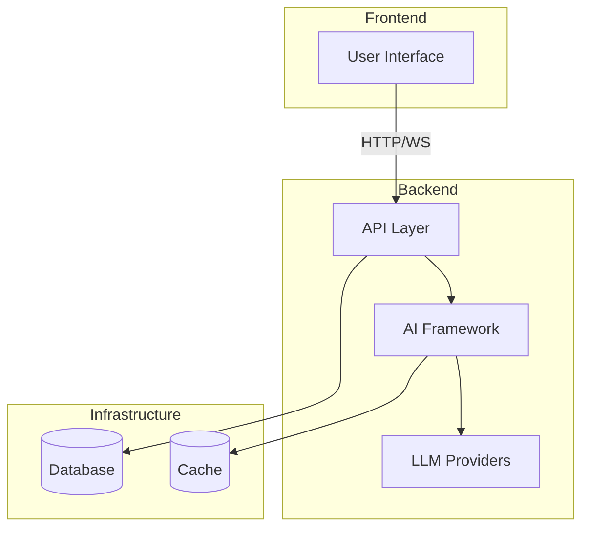

# AI-SDK-ANTHROPIC

[](https://github.com/mk-knight23/AI-SDK-ECOSYSTEM)
[](https://www.anthropic.com/)
[](https://remix.run/)
[](https://fastapi.tiangolo.com/)

> **Framework**: Anthropic Claude (Extended Thinking + Computer Use)
> **Stack**: Remix + FastAPI

---

## 🎯 Project Overview

**AI-SDK-ANTHROPIC** showcases the Anthropic Claude API with extended thinking, message streaming, and computer use capabilities. It demonstrates Claude's 200K context window, artifact generation, and advanced reasoning for building sophisticated AI applications.

### Key Features

- 🧠 **Extended Thinking** - Claude's chain-of-thought reasoning
- 💬 **Message Streaming** - Real-time token-by-token responses
- 🖥️ **Computer Use** - Claude can control computers via API
- 📄 **Artifact Generation** - PDF, code, and content creation
- 🔗 **OpenRouter Fallback** - Multi-provider resilience

---

## 🛠 Tech Stack

| Technology | Purpose |
|-------------|---------|
| Remix | Full-stack framework |
| FastAPI | Backend API |
| Anthropic SDK | Claude integration |
| Chakra UI | Components |
| GraphQL | API layer |

---

## 🚀 Quick Start

```bash
# Frontend
cd app && npm install && npm run dev

# Backend
cd backend && pip install -r requirements.txt && python main.py
```

---

## 🔌 API Integrations

| Provider | Usage |
|----------|-------|
| Anthropic Claude | Primary (extended thinking) |
| OpenRouter | Fallback router |

---

## 📦 Deployment

**Fly.io** (both frontend and backend)

```bash
fly deploy
```

---

## 📁 Project Structure

```
AI-SDK-ANTHROPIC/
├── app/              # Remix application
├── backend/          # FastAPI backend
└── README.md
```

---

## 📝 License

MIT License - see [LICENSE](LICENSE) for details.

---


---

## 🏗️ Architecture



---

## 📡 API Endpoints

| Method | Endpoint | Description |
|--------|----------|-------------|
| GET | /health | Health check |
| POST | /api/execute | Execute agent workflow |
| WS | /api/stream | WebSocket streaming |

---

## 🔧 Troubleshooting

### Common Issues

**Connection refused**
- Ensure backend is running
- Check port availability

**Authentication failures**
- Verify API keys in `.env`
- Check environment variables

**Rate limiting**
- Implement exponential backoff
- Reduce request frequency

---

## 📚 Additional Documentation

- [API Reference](docs/API.md) - Complete API documentation
- [Deployment Guide](docs/DEPLOYMENT.md) - Platform-specific deployment
- [Testing Guide](docs/TESTING.md) - Testing strategies and coverage
---


**Part of the [AI-SDK Ecosystem](https://github.com/mk-knight23/AI-SDK-ECOSYSTEM)**
